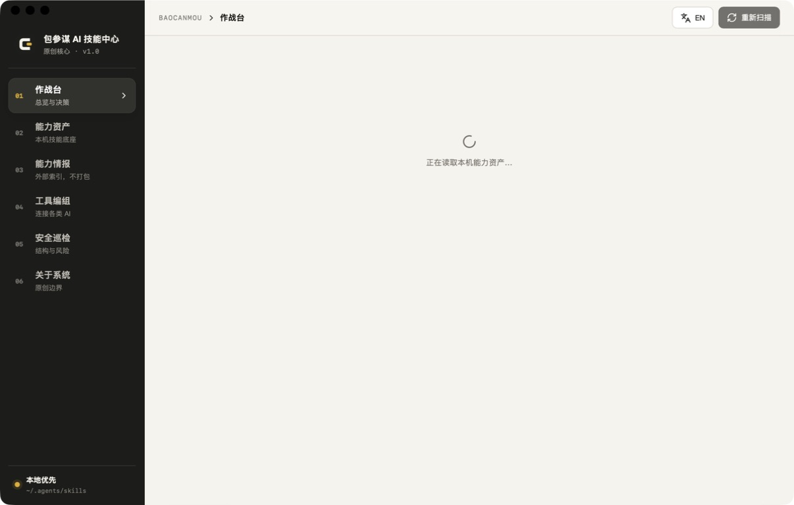
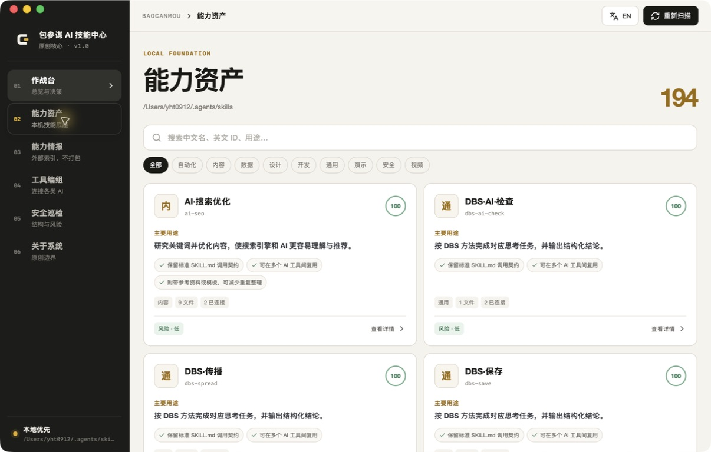
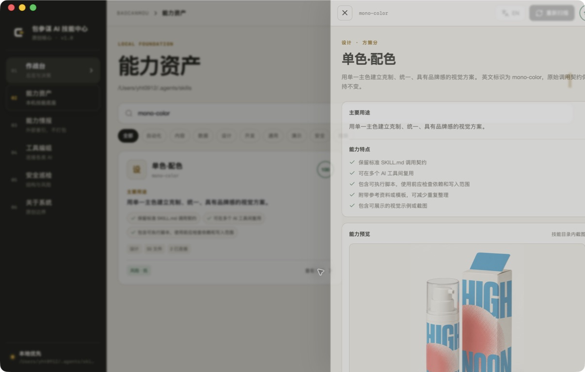

# 包参谋 AI 技能中心

[简体中文](README.md) · [English](README.en.md)

> 包参谋 · [www.bcmsj.com](https://www.bcmsj.com) · 开源交流学习使用

包参谋 AI 技能中心是一套本地优先的跨 AI 能力治理桌面应用。它读取用户自己的 `~/.agents/skills`，为每个 Skill 生成中文名称、明确用途、特点与风险提示，再通过受控链接编组到 Codex、Claude Code、Gemini CLI、Cursor、Hermes、ZCode、OpenCode 与 Windsurf。

## v1.0 原创核心

v1.0 采用包参谋独立定义的「方策五环」：

1. **识别**：只读盘点本机中心源和真实工具入口。
2. **中文化**：保留英文 ID 与调用契约，生成可编辑的中文名称和说明。
3. **评估**：按结构、理解、可移植、安全、可核验五维生成「方策分」。
4. **编组**：macOS/Linux 使用软链接；Windows 优先链接，失败时使用带管理标记的副本。
5. **验收**：连接后重新扫描真实路径，不用界面按钮状态冒充成功。

应用不包含旧项目的数据库、安装器、同步引擎或界面模块。v1.0 核心见 [`src-tauri/src/center.rs`](src-tauri/src/center.rs) 与 [`src/App.tsx`](src/App.tsx)。

App 图标与界面品牌标识统一由原创矢量母版 [`src/assets/baocanmou-mark.svg`](src/assets/baocanmou-mark.svg) 生成。



## 每个技能都能看懂

- 中文主名称 + 英文原名/目录 ID。
- 明确的「主要用途」与最多 5 条能力特点。
- 技能卡第一视觉层直接展示“主要用途”和最多 3 条能力特点，不用装饰性大图抢占信息。
- 技能目录有 PNG/JPG/WebP/GIF 时，只在详情中作为补充展示真实截图。
- 中文名称和说明可在 App 内校正，存放在本机 `~/.baocanmou/skill-center/translations.json`，不修改第三方 `SKILL.md`。



技能详情把主要用途、能力特点、中文理解、工具编组与原始内容集中在同一处；真实截图仅在技能本身提供时补充展示。



## 外部能力情报

「能力情报」只保存公开指标、原始来源和包参谋推荐分，不打包第三方 Skill，也不自动安装。推荐分用于发现，不是 GitHub 用户评分、安全认证或版权背书。任何外部 Skill 在接入前仍需单独核对来源、许可、依赖、权限和内容质量。

## 安全默认

- 默认不上传 Skill 内容。
- 默认不自动安装外部 Skill。
- 不覆盖非本应用管理的目标目录。
- 不删除中心源中的 Skill。
- 只允许安全的单层 Skill ID，拒绝路径穿越。
- `SKILL.md` 阅读上限 512 KB，预览图片上限 2 MB。
- 静态风险提示不等于安全认证。

## 开发与运行

要求 Node.js 20+、Rust 1.77.2+ 和 Tauri 2 对应系统依赖。

```bash
npm ci
npm run tauri:dev
```

网页预览：

```bash
npm run dev
```

完整检查：

```bash
npm run check
```

只读输出真实盘点摘要：

```bash
cargo run --manifest-path src-tauri/Cargo.toml -- --inspect-summary
```

## 开源与权利边界

包参谋编写的项目代码按 [MIT License](LICENSE) 开源。“包参谋 / BaoCanMou”、`www.bcmsj.com` 及项目图形标识不随代码许可自动获得品牌使用授权。

React、Tauri 等通用依赖仍适用各自许可证，见 [THIRD_PARTY_NOTICES.md](THIRD_PARTY_NOTICES.md)。外部能力情报中的仓库与 Skill 归各自权利人所有，仅作为索引引用。

Copyright © 2026 BaoCanMou（包参谋）贡献者。
